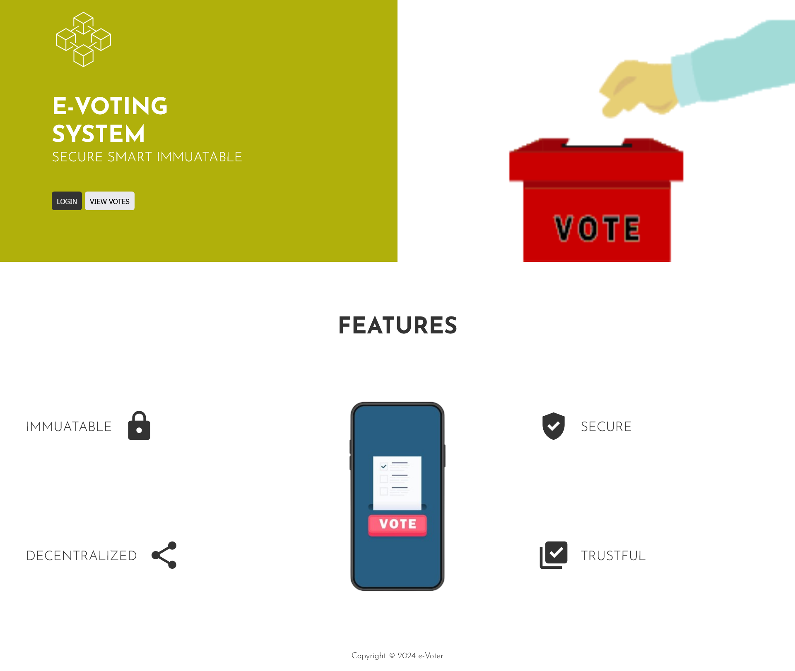
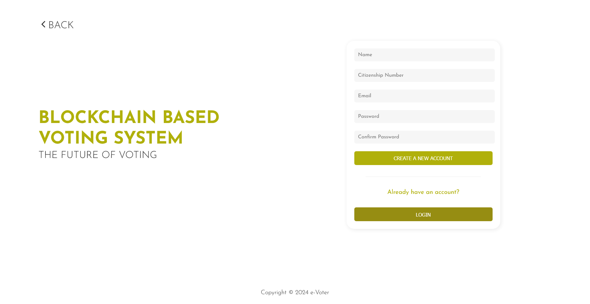
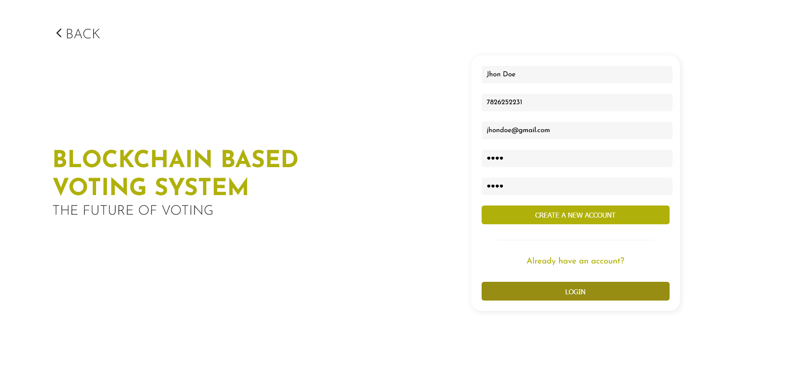
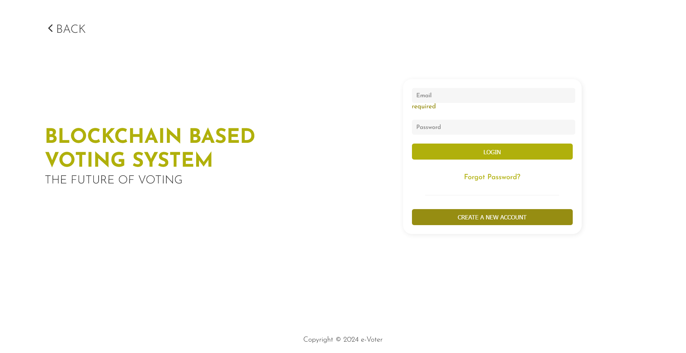
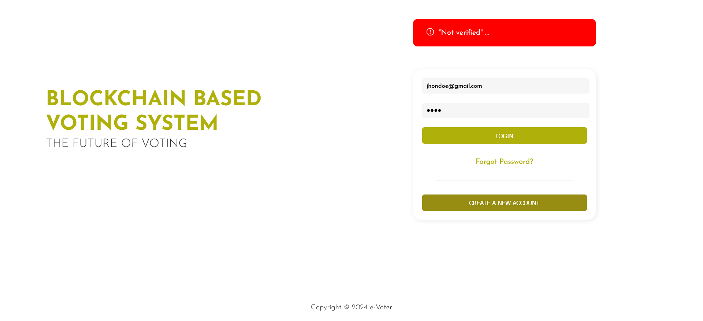
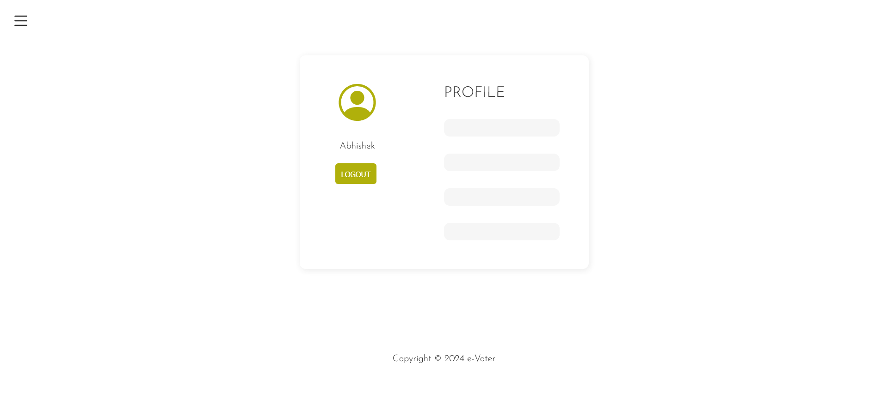
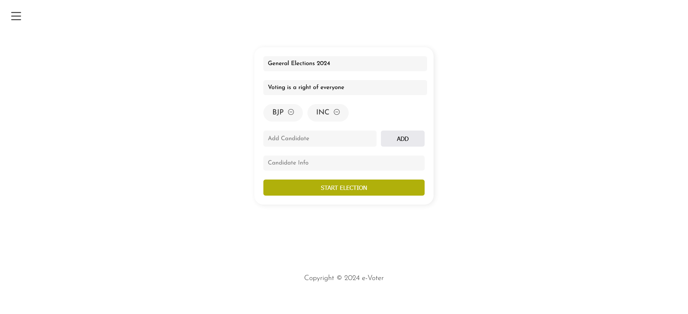
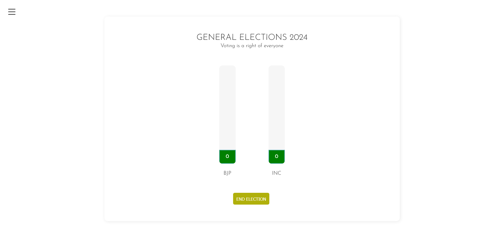
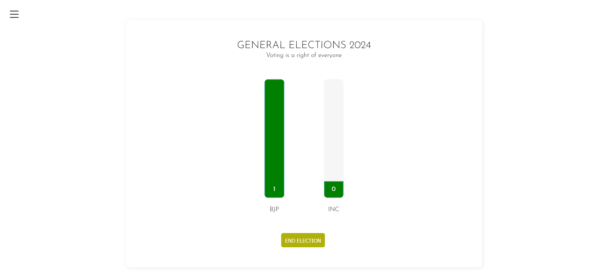
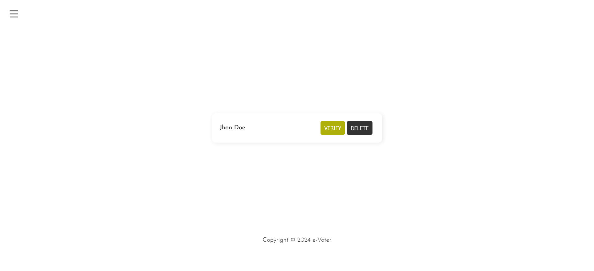

# 🗳️ Blockchain-Based Voting System

## Overview
A decentralized voting system using blockchain technology to ensure transparency and security. The system comprises two modules: **Admin** and **Voter**. Voters can create accounts but need verification to vote. Admins can create polls, manage elections, and more.

## Tech Stack
- **TypeScript**
- **Solidity**
- **React**
- **Ganache**
- **MySQL**

## Features
- **📝 Voter Registration and Verification**: Voters must create an account and wait for verification before voting.
- **📊 Admin Poll Management**: Admins can create and end elections.
- **🔐 Secure Voting**: Voters can only vote once per election.
- **📈 Real-time Results**: Live tracking of votes during the election.
- **🛡️ Immutable Records**: Ensures votes cannot be tampered with.
- **📅 Election Scheduling**: Schedule elections for specific dates and times.

## Project Structure
### 🛠️ Admin Module
- Create Polls
- End Elections
- Verify Users

### 👥 Voter Module
- Create Account
- Login
- Vote in Verified Polls

## Installation
1. **📥 Clone the repository**
    ```bash
    git clone https://github.com/your-repo/blockchain-voting-system.git
    cd blockchain-voting-system
    ```

2. **📦 Install Dependencies**
    ```bash
    npm install
    ```

3. **🛠️ Start Ganache**
    ```bash
    ganache-cli
    ```

4. **🔨 Compile and Deploy Contracts**
    ```bash
    truffle compile
    truffle migrate
    ```

5. **🚀 Start the Application**
    ```bash
    npm start
    ```

## Usage
1. **🏠 Landing Page**
    

2. **🆕 Create Account**
    
    

3. **🔐 Login**
    

4. **⛔ Unverified User Login Attempt**
    

5. **👤 Profile and Logout**
    

6. **📅 Admin Creates Poll**
    
    

7. **🛑 Admin Ends Election**
    

8. **🗳️ Voting Process**
    

9. **✅ Admin Verifies Users**
    

## Thank you 💖
